# SSAFY 4th 자율 프로젝트 1차 sub3

> 배포 주소 : https://i4c106.p.ssafy.io/MAINPAGE

개발자를 위한 개발자 로드맵 제시 및 개인 커스터마이징 로드맵 제공 웹 페이지


#### 제작 기간

> 21.01.11 ~ 21.02.19 (6주간 진행)


#### 참여 인원

> 6명

| 역할         | 이름   |
| ------------ | ------ |
| 팀장, 백엔드 | 김하늘 |
| 백엔드       | 윤건상 |
| 백엔드       | 윤승환 |
| 프론트엔드   | 곽온겸 |
| 프론트엔드   | 김다민 |
| 프론트엔드   | 조명희 |


## 🚀 Getting Started

### Requisites

- Java
- npm
- MySQL Workbench
- STS


---

## 📂프로젝트 구조

```
project
├─backend
│  ├─board
│  │  └─src
│  │      └─main
│  │            ├─java
│  │            │  └─com
│  │            │      └─web
│  │            │          └─blog
│  │            │              ├─config
│  │            │              ├─controller
│  │            │              └─model
│  │            │                  ├─dto
│  │            │                  ├─repo
│  │            │                  └─service
│  │            └─resources
│  │                └─mapper
│  ├─chatting
│  │  └─src
│  │       └─main
│  │            ├─java
│  │            │  └─com
│  │            │      └─web
│  │            │          └─blog
│  │            │              ├─component
│  │            │              ├─config
│  │            │              ├─controller
│  │            │              └─model
│  │            │                  ├─dto
│  │            │                  ├─repo
│  │            │                  └─service
│  │            └─resources
│  ├─roadmap
│  │  └─src
│  │       └─main
│  │            ├─java
│  │            │  └─com
│  │            │      └─web
│  │            │          └─blog
│  │            │              ├─config
│  │            │              ├─controller
│  │            │              └─model
│  │            │                  ├─dto
│  │            │                  ├─repo
│  │            │                  └─service
│  │            └─resources
│  │                ├─mapper
│  │                └─statics
│  │                    └─upload
│  │                        └─1
│  └─user
│      └─src
│           └─main
│                ├─java
│                │  └─com
│                │      └─web
│                │          └─blog
│                │              ├─config
│                │              ├─controller
│                │              ├─exception
│                │              ├─interceptor
│                │              ├─model
│                │              │  ├─dto
│                │              │  ├─repo
│                │              │  └─service
│                │              └─util
│                └─resources
│                    └─mapper
└─frontend
    └─src
        ├─components
        │  ├─Board
        │  ├─Breadcrumb
        │  ├─Cards
        │  ├─Charts
        │  ├─Chatting
        │  ├─Collapse
        │  ├─Inputs
        │  ├─Login
        │  ├─Logout
        │  ├─Navbar
        │  ├─NotificationPlugin
        │  ├─Profileupdate
        │  ├─Roadmap
        │  │  └─ShareRoadmap
        │  ├─SidebarPlugin
        │  ├─Tabs
        │  └─Validation
        ├─routes
        ├─store
        └─views
            ├─Board
            │  ├─Posting
            │  └─Tables
            ├─Calendar
            ├─Chatting
            ├─Dashboard
            ├─Layout
            ├─Mainpage
            ├─Maps
            ├─Pages
            │  └─UserProfile
            ├─Roadmap
            ├─Search
            ├─ShareRoadmap
            ├─Starter
            └─Tables
                └─RegularTables
```


---

## 🖌ERD (Entity-Relationship Diagram)

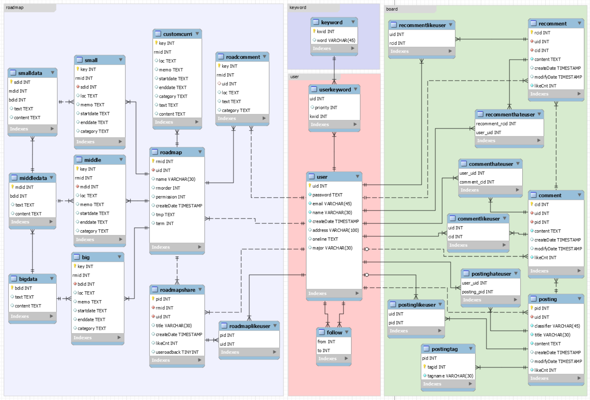

---


## ✨아키텍처


## 📜 기능 설명

### 🎨로드맵 기능

#### 공식 로드맵 제공

- 기본적인 로드맵 제공을 통해 사용자 편의성 향상

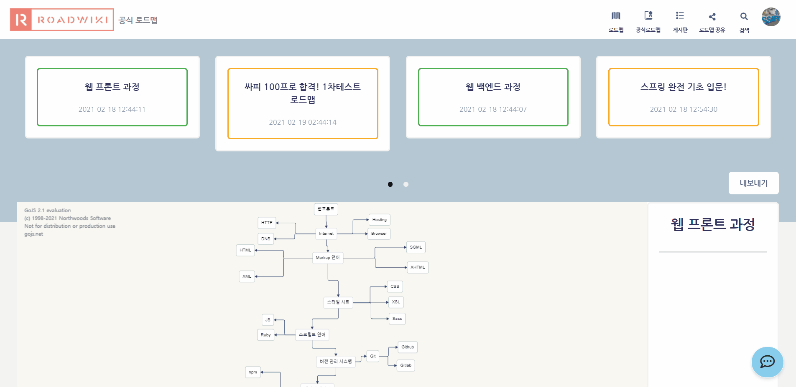

#### 로드맵 커스터마이징 기능

- 사용자 맞춤형 로드맵 생성 및 수정 가능
- 사용자 참여형 로드맵 생성 기능 제공

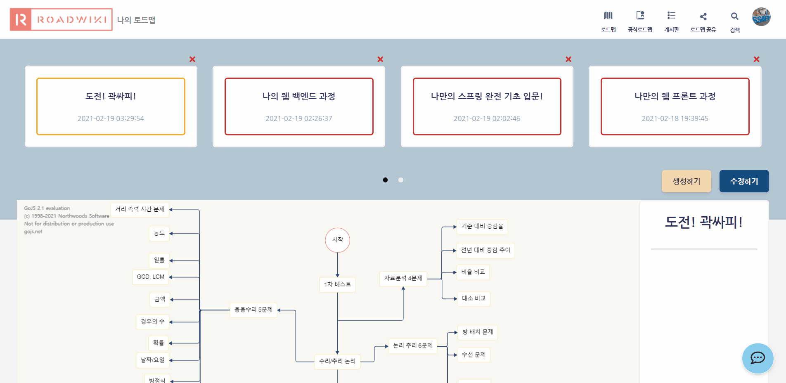

#### 로드백 기능

- 로드맵 공유기능을 통해 유저 맞춤 피드백 제공

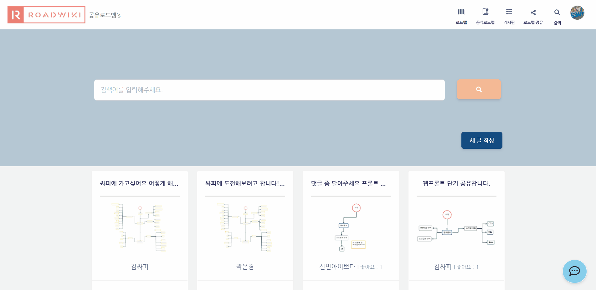

---

### 👩‍💻커뮤니티

#### 게시판

- 타유저와의 소통 공간

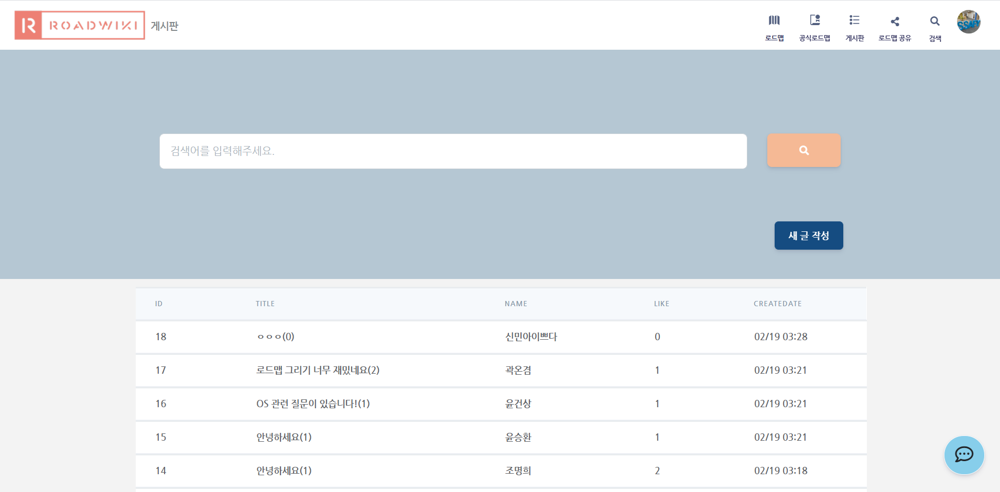

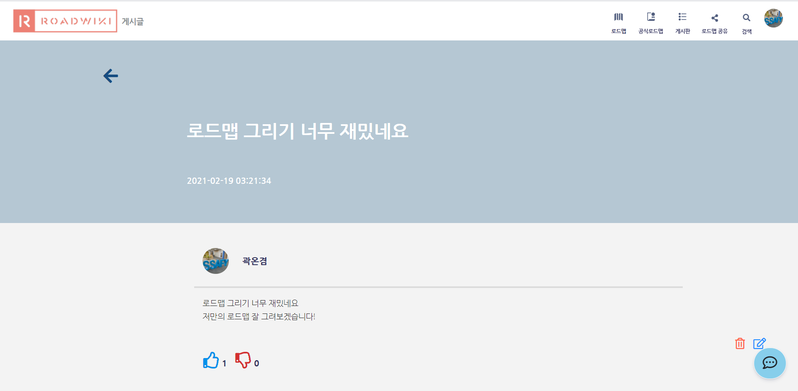

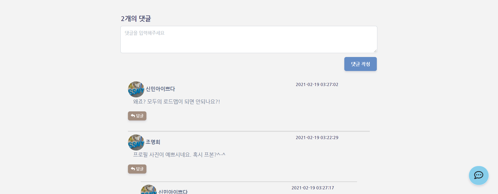

---

### 😀유저 관리

#### 회원가입

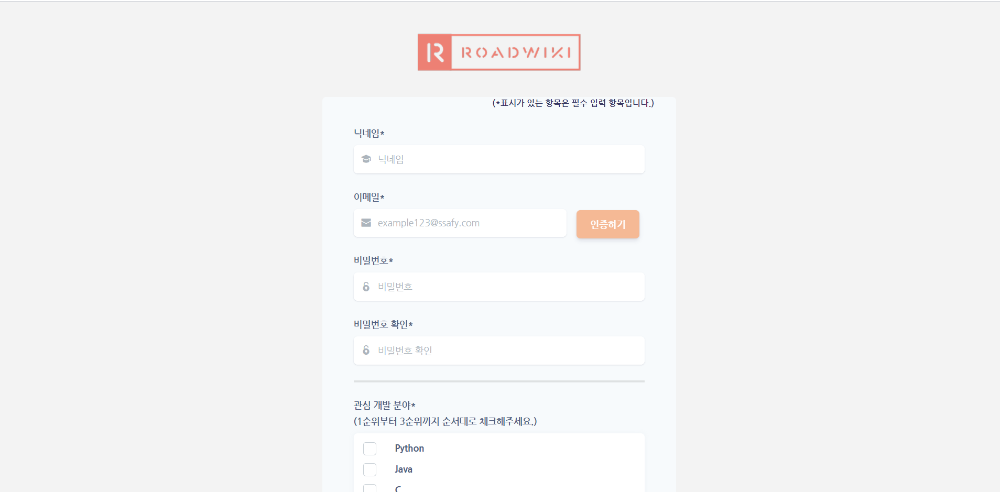

#### 로그인 / 로그아웃

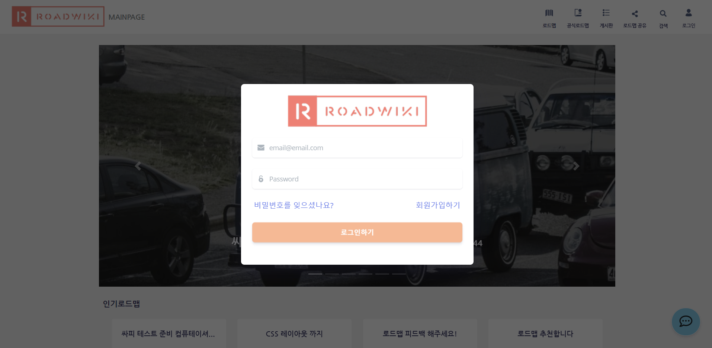

#### 회원정보

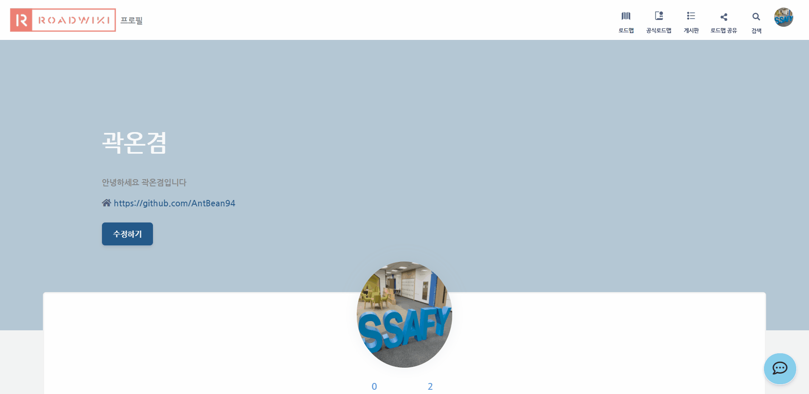

#### 회원정보 수정 / 회원탈퇴

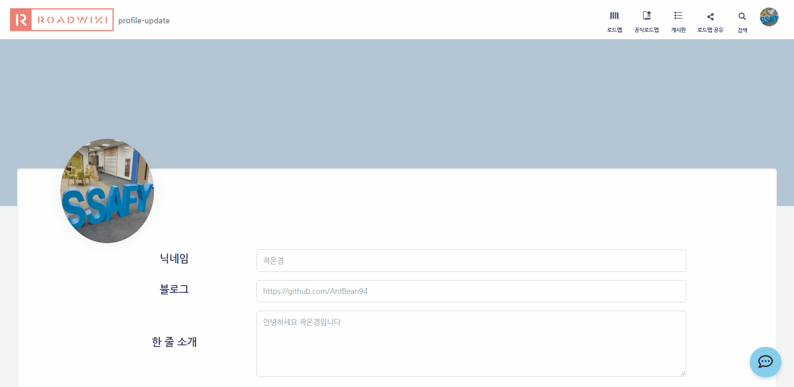

#### 비밀번호 재설정

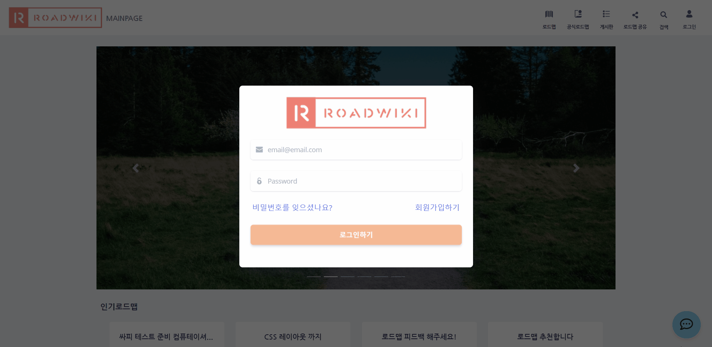

---

### 🤳채팅

#### 실시간 채팅 기능

- 관심 분야별 실시간 채팅 참여 기능 제공

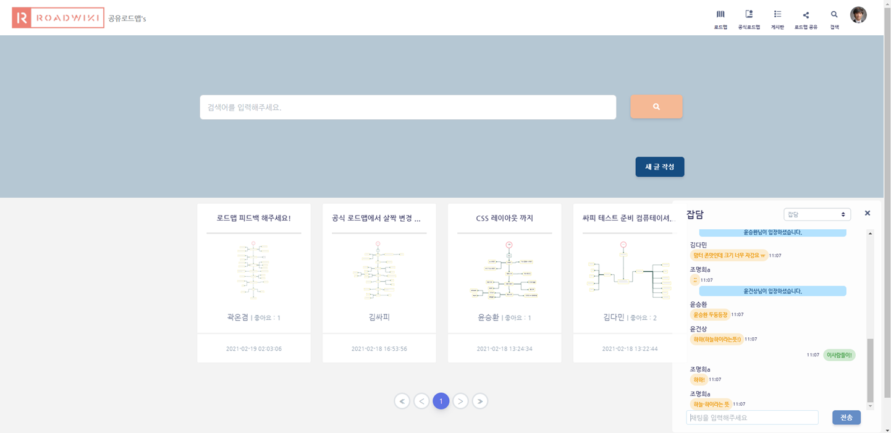


